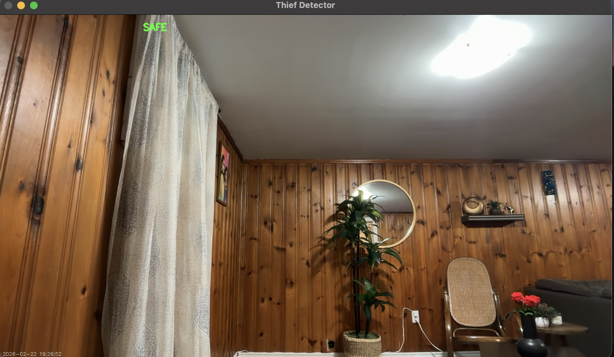
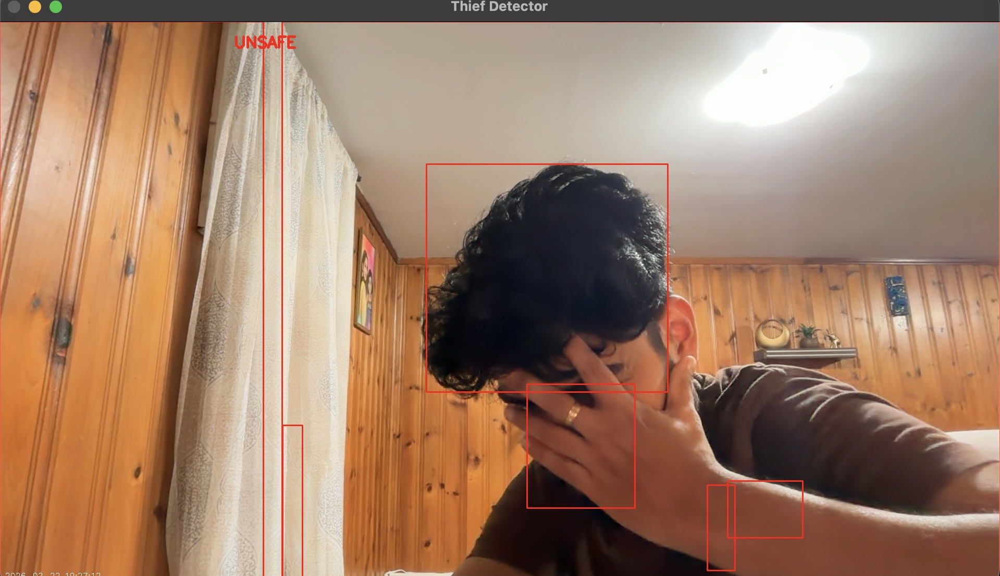

# 🚨 Thief Detection System — AI Computer Vision


A real-time **AI-powered security system** that uses computer vision to detect motion and intruders through your webcam. Built with Python and OpenCV using background subtraction techniques.

---

## 🎥 Demo

## 🎥 Demo

| Status | Preview |
|--------|---------|
| 🟢 **SAFE** — No motion detected | Green label on live feed |
| 🔴 **UNSAFE** — Intruder detected | Red label + bounding box + alert |

### 📸 Screenshots

**🟢 SAFE — No motion detected:**



**🔴 UNSAFE — Intruder detected:**



### 🎬 Demo Video

> Click to download and watch the demo recording:

[▶️ Watch Demo Video](demo/demo.mp4)

---

## ✨ Features

- 🎥 **Real-time webcam monitoring** — Live video feed with status overlay
- 🧠 **Motion detection** — Background subtraction using Gaussian blur & frame differencing
- 🔴 **Intruder alerts** — Instant `[ALERT] 🚨 Intruder detected` console notifications
- 📦 **Bounding boxes** — Draws red rectangles around detected motion areas
- 🕐 **Timestamp overlay** — Live date & time displayed on every frame
- 💾 **Auto recording** — Saves `.mp4` video to `output/recordings/`
- 🍎 **Mac optimised** — Uses AVFoundation backend for FaceTime HD camera

---

## 🗂️ Project Structure

```
thief-detection/
├── main.py                          # Entry point
├── requirements.txt                 # Python dependencies
├── .gitignore                       # Git ignored files
├── README.md                        # This file
│
├── src/                             # Core source code
│   ├── __init__.py
│   ├── detector.py                  # Main detection loop & camera handling
│   ├── motion.py                    # Motion detection algorithm
│   └── alarm.py                     # Alert system
│
├── notebooks/                       # Jupyter notebooks for experimentation
│   └── Thief_Detector.ipynb
│
├── tests/                           # Unit tests
│   └── test_detector.py
│
└── output/
    └── recordings/                  # Saved .mp4 recordings (git ignored)
```

---

## ⚙️ How It Works

```
Webcam Frame
     │
     ▼
Convert to Grayscale
     │
     ▼
Apply Gaussian Blur
     │
     ▼
Compare with Background Frame (absdiff)
     │
     ▼
Apply Threshold → Binary Image
     │
     ▼
Dilate to Fill Gaps
     │
     ▼
Find Contours (filter small ones)
     │
     ├── Contours found? → 🔴 UNSAFE → Draw boxes + Trigger Alarm
     │
     └── No contours?   → 🟢 SAFE → Reset Alarm
```

### Key Algorithms Used

| Algorithm | Purpose |
|-----------|---------|
| `cv2.absdiff()` | Compares current frame vs background |
| `cv2.GaussianBlur()` | Reduces noise in frames |
| `cv2.threshold()` | Converts diff to binary image |
| `cv2.dilate()` | Fills gaps in motion regions |
| `cv2.findContours()` | Detects motion boundaries |
| `cv2.boundingRect()` | Draws boxes around motion |

---

## 🛠️ Tech Stack

| Tool | Version | Purpose |
|------|---------|---------|
| Python | 3.13 | Core language |
| OpenCV (`cv2`) | 4.13 | Computer vision & video |
| NumPy | latest | Array operations |

---

## 🚀 Installation & Setup

### Prerequisites

- macOS (optimised) or Linux/Windows
- Python 3.9+
- Webcam / FaceTime HD camera

### Step 1 — Clone the Repository

```bash
git clone https://github.com/Aswinab97/Thief-Detection-System-AI-Computer-Vision-.git
cd Thief-Detection-System-AI-Computer-Vision-
```

### Step 2 — Create Virtual Environment

```bash
python -m venv venv
source venv/bin/activate        # Mac/Linux
# OR
venv\Scripts\activate           # Windows
```

### Step 3 — Install Dependencies

```bash
pip install -r requirements.txt
```

### Step 4 — Run the System

```bash
python main.py
```

---

## ▶️ Usage

```bash
# Activate venv first
source venv/bin/activate

# Run the detector
python main.py
```

### Controls

| Key | Action |
|-----|--------|
| `q` | Quit and save recording |
| `ESC` | Quit and save recording |

### Output

- **Live window** — Opens `Thief Detector` window with real-time feed
- **Console alerts** — Prints `[ALERT] 🚨 Intruder detected at YYYY-MM-DD HH:MM:SS`
- **Recording** — Saved automatically to `output/recordings/recording.mp4`

---

## 📁 Source Files Explained

### `main.py`
Entry point of the application. Initialises the `ThiefDetector` and starts the detection loop.

### `src/detector.py`
Core detection class. Handles:
- Camera initialisation (AVFoundation backend for Mac)
- Camera warm-up to avoid black frames
- Frame reading loop
- Drawing status labels and timestamps
- Saving video recordings

### `src/motion.py`
Motion detection algorithm. Handles:
- Storing the background frame
- Frame differencing using `absdiff`
- Thresholding and dilation
- Contour detection and filtering

### `src/alarm.py`
Alert system. Handles:
- Triggering alerts when motion is detected
- Printing timestamped alerts to console
- Resetting alarm state when no motion

---

## 🍎 Mac-Specific Notes

### Continuity Camera Conflict
If your iPhone is connected via Continuity Camera, the system may open the iPhone camera instead of the built-in FaceTime HD. To fix:

```
iPhone → Settings → General → AirPlay & Continuity → Continuity Camera → OFF
```

### Conda vs venv
If using Anaconda, always use the full venv path to run:

```bash
/path/to/thief-detection/venv/bin/python main.py
```

Or disable conda auto-activation:
```bash
conda config --set auto_activate_base false
```

---

## 🧪 Running Tests

```bash
source venv/bin/activate
python -m pytest tests/
```

---

## 📦 Requirements

```
opencv-python
numpy
```

Install with:
```bash
pip install -r requirements.txt
```

---

## 🔮 Future Improvements

- [ ] 📧 Email/SMS notifications on intruder detection
- [ ] 📱 Mobile app integration
- [ ] 🤖 Deep learning model for person detection (YOLO)
- [ ] ☁️ Cloud storage for recordings
- [ ] 🌐 Web dashboard for live monitoring
- [ ] 🔊 Audio alarm on detection
- [ ] 📷 Multi-camera support

---

## 👨‍💻 Author

**Aswin Anil Bindu**
- GitHub: [@Aswinab97](https://github.com/Aswinab97)

---

## 📄 License

This project is licensed under the MIT License.

---

⭐ **If you found this useful, give it a star!** ⭐